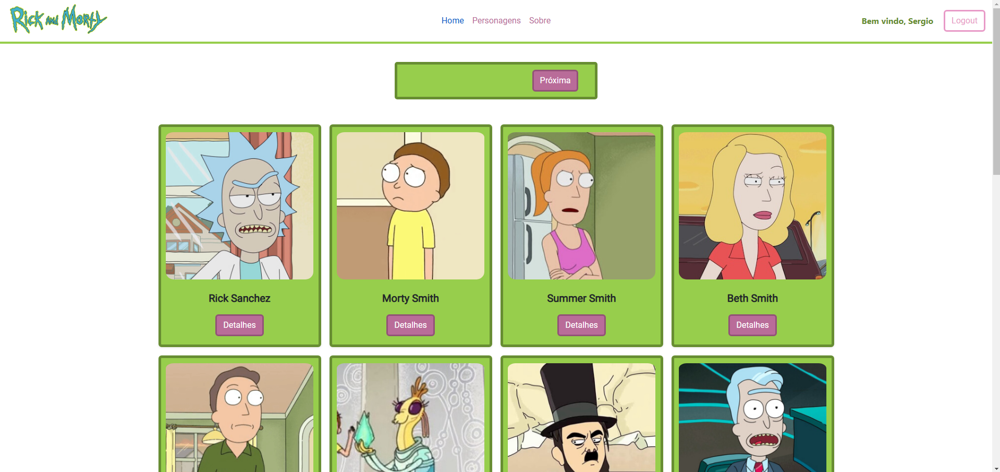
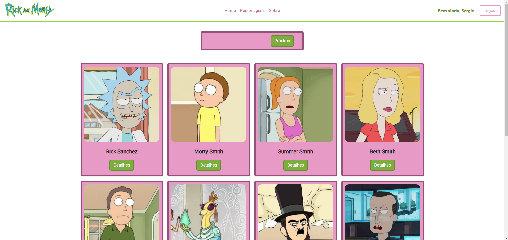
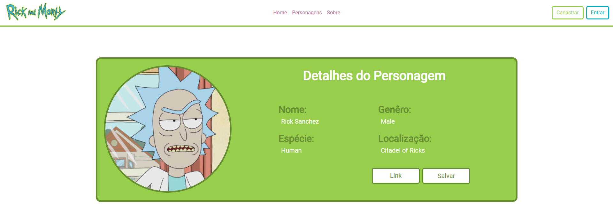
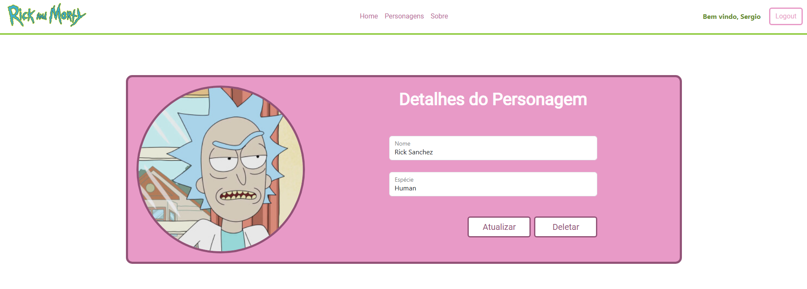
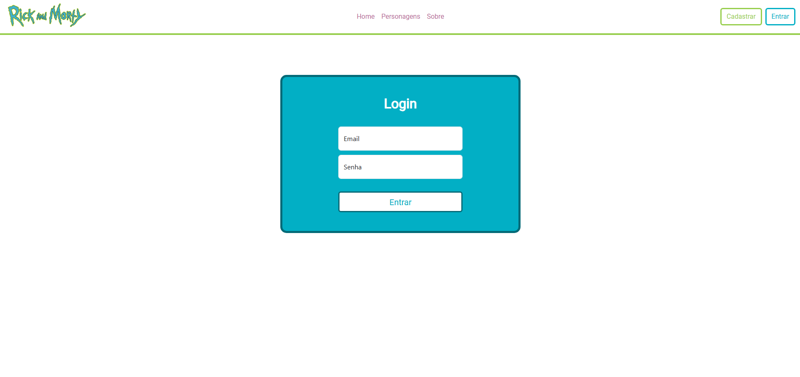
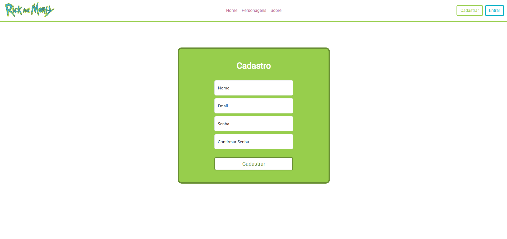
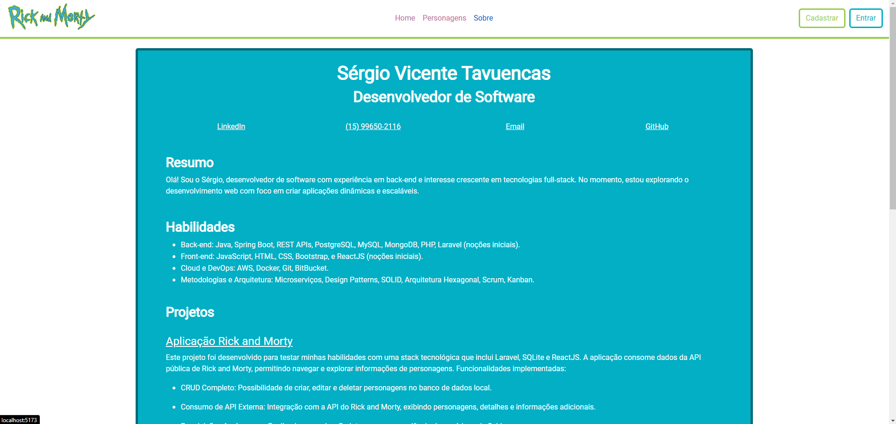

# Aplicação Rick and Morty

Este projeto foi desenvolvido para testar minhas habilidades com uma stack tecnológica que inclui Laravel, SQLite e ReactJS. A aplicação consome dados da API pública de Rick and Morty, permitindo navegar e explorar informações de personagens. Funcionalidades implementadas:

## Tecnologias utilizadas

-   Laravel
-   SQLite
-   ReactJS
-   Bootstrap

## Páginas da aplicação

**HOME**

A Home exibe uma listagem dos personagens vindos da [API](https://rickandmortyapi.com/) e com paginação. Os personagens são dispostos como cards com uma imagem, nome e um botão que leva para a página de detalhes do mesmo:

**PERSONAGENS**

Tela similar a "Home", a única diferença além das cores é que as informações dos personagens vem do banco de dados local, ou seja, dos personagens salvos pelos usuários:

**DETALHES DO PERSONAGEM**

***OBS: As ações de Salvar, Atualizar e Deletar são permitidas apenas a usuário logados atráves dos tokens gerados que são utilizados para controle de requisições.***

Caso o usuário tenha vindo da página "Home", lhe é permitido "Salvar" as seguintes informações do personagem:

    { name, species, gender, location, image, url }

Além de permitir navegar até o "Link" original da API para consultar as informações listadas.

Ao clicar em salvar as seguintes informações serão armazenadas no banco de dados local:

    { name, species, image, url, created_at, updated_at }

Caso o usuário tenha vindo da página "Personagens", lhe é permitido "Editar" e "Deletar", e portanto, é possível editar as seguintes informações:

    { name, species }

**LOGIN / CADASTRO**

Páginas de cadastro e login, onde as seguintes informações do usuário são salvas no banco de dados local:

    { name, email, password }

### Tela de login

### Tela de cadastro

**SOBRE**

Mini currículo com links para minhas redes sociais, um breve resumo, habilidades, e a melhor parte, projetos que desenvolvi:

## Rodando o projeto

Consulte o  para as instruções de como rodar o projeto em sua máquina local.

## GitHub

## Contact
Sinta-se à vontade para entrar em contato comigo através de minhas redes sociais se tiver dúvidas sobre minha carreira, projetos em que estou trabalhando, o que estou estudando ou qualquer conselho que você possa ter, seja relacionado à carreira ou sugestões de melhorias em meu código .

  
  
  
  

